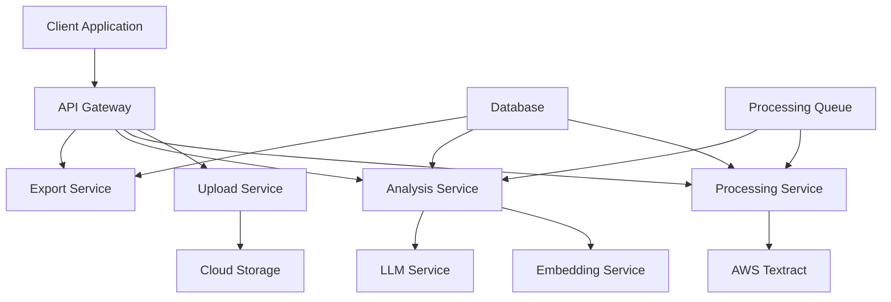

# Design Document

## Overview

Chicken Scratch is a web-based application that transforms physical notes into digital insights through a multi-stage processing pipeline. The system accepts image uploads, performs OCR extraction using AWS Textract, applies semantic clustering to organize content, and generates exportable summaries. The architecture emphasizes scalability, reliability, and user experience across both mobile and desktop platforms.

## Architecture

### High-Level Architecture



### Technology Stack

**Frontend:**
- React.js with TypeScript for type safety
- Responsive design framework (Tailwind CSS)
- Progressive Web App (PWA) capabilities for mobile experience
- File upload with drag-and-drop and camera integration

**Backend:**
- Node.js with Express.js framework
- TypeScript for consistency across stack
- JWT authentication for session management
- RESTful API design with OpenAPI documentation

**Cloud Services:**
- AWS Textract for OCR processing
- AWS S3 for image storage
- OpenAI API for embeddings and LLM processing
- Redis for caching and session storage

**Database:**
- PostgreSQL for structured data (projects, users, metadata)
- Vector database (Pinecone/Weaviate) for embedding storage and similarity search

**Infrastructure:**
- Docker containers for deployment
- AWS ECS or similar container orchestration
- CloudFront CDN for static assets
- Application Load Balancer for high availability

## Components and Interfaces

### 1. Upload Component

**Responsibilities:**
- Handle file uploads from multiple sources (camera, file picker)
- Validate file formats and sizes
- Generate unique identifiers for processing tracking
- Store images in cloud storage with metadata

**Interfaces:**
```typescript
interface UploadRequest {
  files: File[];
  projectName?: string;
  userId: string;
}

interface UploadResponse {
  uploadId: string;
  fileIds: string[];
  status: 'uploaded' | 'processing' | 'failed';
}
```

### 2. OCR Processing Component

**Responsibilities:**
- Interface with AWS Textract for text extraction
- Handle both synchronous and asynchronous processing
- Extract bounding box information for note regions
- Provide confidence scores for extracted text

**Interfaces:**
```typescript
interface OCRRequest {
  imageUrl: string;
  processingOptions: {
    detectHandwriting: boolean;
    detectTables: boolean;
    detectForms: boolean;
  };
}

interface OCRResponse {
  extractedText: TextBlock[];
  boundingBoxes: BoundingBox[];
  confidence: number;
  processingTime: number;
}

interface TextBlock {
  id: string;
  text: string;
  confidence: number;
  boundingBox: BoundingBox;
  type: 'LINE' | 'WORD' | 'CELL';
}
```

### 3. Text Processing Component

**Responsibilities:**
- Clean and normalize extracted text
- Remove OCR artifacts and noise
- Perform spell checking and correction
- Maintain text-to-region mapping

**Interfaces:**
```typescript
interface TextCleaningRequest {
  rawText: TextBlock[];
  cleaningOptions: {
    spellCheck: boolean;
    removeArtifacts: boolean;
    normalizeSpacing: boolean;
  };
}

interface CleanedText {
  originalId: string;
  cleanedText: string;
  corrections: TextCorrection[];
  confidence: number;
}
```

### 4. Semantic Clustering Component

**Responsibilities:**
- Generate embeddings for text content
- Perform clustering using similarity algorithms
- Generate theme labels for clusters
- Allow manual cluster adjustments

**Interfaces:**
```typescript
interface ClusteringRequest {
  textBlocks: CleanedText[];
  clusteringMethod: 'embeddings' | 'llm' | 'hybrid';
  targetClusters?: number;
}

interface ClusterResult {
  clusters: Cluster[];
  unclustered: string[];
  confidence: number;
}

interface Cluster {
  id: string;
  label: string;
  textBlocks: string[];
  centroid?: number[];
  confidence: number;
}
```

### 5. Analysis and Summary Component

**Responsibilities:**
- Generate comprehensive summaries
- Calculate theme distributions
- Extract representative quotes
- Create exportable insights

**Interfaces:**
```typescript
interface SummaryRequest {
  clusters: Cluster[];
  originalText: CleanedText[];
  summaryOptions: {
    includeQuotes: boolean;
    includeDistribution: boolean;
    maxThemes: number;
  };
}

interface ProjectSummary {
  topThemes: ThemeSummary[];
  overallInsights: string;
  distribution: ThemeDistribution[];
  representativeQuotes: Quote[];
  metadata: SummaryMetadata;
}
```

### 6. Export Component

**Responsibilities:**
- Generate PDF reports with formatting
- Create CSV exports for data analysis
- Handle file generation and download
- Maintain export history

**Interfaces:**
```typescript
interface ExportRequest {
  projectId: string;
  format: 'pdf' | 'csv';
  options: ExportOptions;
}

interface ExportOptions {
  includeSummary: boolean;
  includeOriginalText: boolean;
  includeImages: boolean;
  customTemplate?: string;
}
```

## Data Models

### Core Entities

```typescript
// Project entity
interface Project {
  id: string;
  userId: string;
  name: string;
  description?: string;
  createdAt: Date;
  updatedAt: Date;
  status: 'processing' | 'completed' | 'failed';
  imageCount: number;
  summary?: ProjectSummary;
}

// Image entity
interface ProcessedImage {
  id: string;
  projectId: string;
  originalUrl: string;
  filename: string;
  uploadedAt: Date;
  processingStatus: 'pending' | 'processing' | 'completed' | 'failed';
  ocrResults?: OCRResponse;
  boundingBoxes: BoundingBox[];
}

// Note entity (extracted from images)
interface Note {
  id: string;
  imageId: string;
  originalText: string;
  cleanedText: string;
  boundingBox: BoundingBox;
  confidence: number;
  clusterId?: string;
  embedding?: number[];
}

// User entity
interface User {
  id: string;
  email: string;
  name: string;
  createdAt: Date;
  preferences: UserPreferences;
}
```

### Supporting Types

```typescript
interface BoundingBox {
  left: number;
  top: number;
  width: number;
  height: number;
}

interface UserPreferences {
  defaultClusteringMethod: 'embeddings' | 'llm' | 'hybrid';
  autoProcessing: boolean;
  exportFormat: 'pdf' | 'csv';
  theme: 'light' | 'dark';
}

interface ThemeSummary {
  label: string;
  noteCount: number;
  percentage: number;
  keyTerms: string[];
  representativeQuote: string;
}
```

## Error Handling

### Error Categories

1. **Upload Errors**
   - File size exceeded
   - Unsupported format
   - Network connectivity issues
   - Storage quota exceeded

2. **Processing Errors**
   - OCR service unavailable
   - Image quality too poor
   - Text extraction timeout
   - Invalid image content

3. **Analysis Errors**
   - Clustering algorithm failure
   - Insufficient text content
   - LLM service unavailable
   - Embedding generation failure

4. **Export Errors**
   - Template rendering failure
   - File generation timeout
   - Storage write failure
   - Format conversion error

### Error Handling Strategy

```typescript
interface ErrorResponse {
  code: string;
  message: string;
  details?: any;
  retryable: boolean;
  timestamp: Date;
}

// Centralized error handling
class ErrorHandler {
  static handle(error: Error, context: string): ErrorResponse {
    // Log error with context
    // Determine if retryable
    // Generate user-friendly message
    // Return structured response
  }
}
```

### Retry Logic

- Exponential backoff for transient failures
- Circuit breaker pattern for external services
- Dead letter queue for failed processing jobs
- User notification for non-recoverable errors

## Testing Strategy

### Unit Testing
- Component-level testing for all services
- Mock external dependencies (AWS Textract, OpenAI)
- Test data validation and transformation logic
- Coverage target: 90%+

### Integration Testing
- End-to-end API testing
- Database integration tests
- External service integration tests
- File upload and processing workflows

### Performance Testing
- Load testing for concurrent uploads
- OCR processing performance benchmarks
- Database query optimization
- Memory usage profiling

### User Acceptance Testing
- Cross-browser compatibility testing
- Mobile responsiveness testing
- Accessibility compliance (WCAG 2.1)
- User workflow validation

### Test Data Management
- Synthetic test images with known content
- Handwriting samples from multiple sources
- Edge cases (poor quality, mixed content)
- Performance test datasets

### Monitoring and Observability
- Application performance monitoring (APM)
- Error tracking and alerting
- Usage analytics and metrics
- Cost monitoring for cloud services

This design provides a robust foundation for implementing the Chicken Scratch application while maintaining scalability, reliability, and user experience across all target platforms.